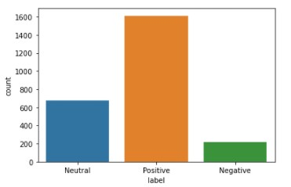
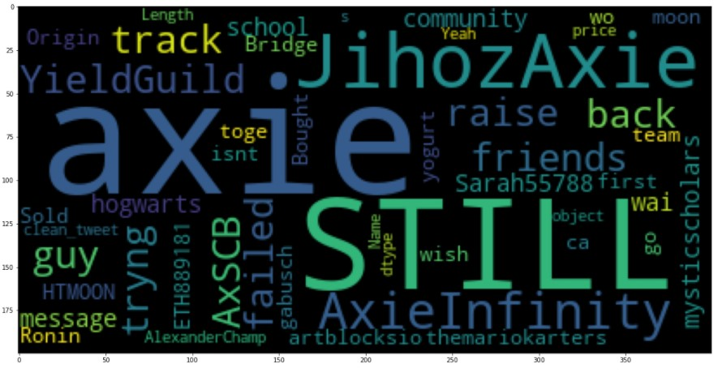
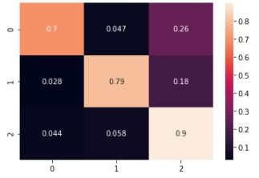

# Twitter Scraper and Sentiment Analysis 

## Importing Libraries needed for the project and setting up Tweepy Api values:


```python
import tweepy
import pandas as pd
import numpy as np
import pickle
from tweepy import OAuthHandler
import tweepy
import pandas as pd
import re
from textblob import TextBlob
import preprocessor as p
import seaborn as sns
import matplotlib.pyplot as plt
import seaborn as sns
from jupyterthemes import jtplot

#Api Key eOOKGQoNmNTxKn5Lylo7B2oAm
#Api Key Secret HZKp8YsPJCbQ25oWBiQdtENUp0VGrXd0bb3nEUq5zpnlC1yAB0
#Bearer Token AAAAAAAAAAAAAAAAAAAAALNlNgEAAAAAZqHsiiabkj8VmL8%2FNPL%2FKW4YyaU%3DYUDhfCpTKAKbDoz9l1rf8Or7520K9uvMNALjxp8HKIkGXLZvSQ
#Access token 97388220-gHLDvXB0pvm9oDJDLJnoi66bh9NsFzk53uxCn1AqA
#Access token secret DvQ2yRth9V9gnWFcTRT4JNxlmmiK8q8QwFATc13JsqzHH

CONSUMER_KEY = "eOOKGQoNmNTxKn5Lylo7B2oAm"
CONSUMER_SECRET = "HZKp8YsPJCbQ25oWBiQdtENUp0VGrXd0bb3nEUq5zpnlC1yAB0"
ACCESS_TOKEN = "97388220-gHLDvXB0pvm9oDJDLJnoi66bh9NsFzk53uxCn1AqA"
ACCESS_TOKEN_SECRET = "DvQ2yRth9V9gnWFcTRT4JNxlmmiK8q8QwFATc13JsqzHH"

def auth():
    try:
        auth = tweepy.OAuthHandler(CONSUMER_KEY, CONSUMER_SECRET)
        auth.set_access_token(ACCESS_TOKEN, ACCESS_TOKEN_SECRET)
        api = tweepy.API(auth)
    except:
        print("An error occurred during the authentication")
    
    return api

```

## Function to scrape data
Using tweepy.Cursor with some parameters and appending to a DF


```python
def search_by_hashtag(api, date_since, date_until, words):
    df = pd.DataFrame(columns=['id', 'created_at', 'username', 'location', 'following', 
                               'followers', 'retweetcount', 'text']) 
    tweets = tweepy.Cursor(api.search, q=words, lang="en", wait_on_rate_limit=True,
                           start_time=date_since, end_time=date_until, tweet_mode='extended').items(2500) 
    list_tweets = [tweet for tweet in tweets] 
         
    for tweet in list_tweets: 
        id = tweet.id
        created_at = tweet.created_at
        username = tweet.user.screen_name 
        location = tweet.user.location 
        following = tweet.user.friends_count 
        followers = tweet.user.followers_count 
        totaltweets = tweet.user.statuses_count 
        retweetcount = tweet.retweet_count 

        try: 
            text = tweet.retweeted_status.full_text 
        except AttributeError: 
            text = tweet.full_text 
  
        tweets = [id, created_at, username, location, following, 
                     followers, retweetcount, text] 

        df.loc[len(df)] = tweets 
          
    filename = 'tweets.csv'
    df.to_csv(filename)
    return df
```

### Executing function with parameters

Scraping the 2500 tweets with the word "Axie" between 01 July 2021 to 10 July 2021.


```python
api = auth()
# Words to find in tweets
words = "Axie"
# Date from format YYYY-MM-DD
date_since = "2021-07-01"
# Date to format YYYY-MM-DD
date_until = "2021-07-10"
# Executing function
search_by_hashtag(api, date_since, date_until, words)
```


<div>
<style scoped>
    .dataframe tbody tr th:only-of-type {
        vertical-align: middle;
    }

    .dataframe tbody tr th {
        vertical-align: top;
    }

    .dataframe thead th {
        text-align: right;
    }
</style>
<table border="1" class="dataframe">
  <thead>
    <tr style="text-align: right;">
      <th></th>
      <th>id</th>
      <th>created_at</th>
      <th>username</th>
      <th>location</th>
      <th>following</th>
      <th>followers</th>
      <th>retweetcount</th>
      <th>text</th>
    </tr>
  </thead>
  <tbody>
    <tr>
      <th>0</th>
      <td>1420028178916159510</td>
      <td>2021-07-27 14:27:55</td>
      <td>Yuzu16678399</td>
      <td></td>
      <td>21</td>
      <td>1</td>
      <td>107</td>
      <td>Giving away 5 Axie Scholarships \n1. Follow me...</td>
    </tr>
    <tr>
      <th>1</th>
      <td>1420028152689090560</td>
      <td>2021-07-27 14:27:49</td>
      <td>DeticJoseph</td>
      <td></td>
      <td>100</td>
      <td>1</td>
      <td>0</td>
      <td>@Axie_maxi Hi manager,,</td>
    </tr>
    <tr>
      <th>2</th>
      <td>1420028151992832009</td>
      <td>2021-07-27 14:27:48</td>
      <td>aceyzap1</td>
      <td>Philippines</td>
      <td>20</td>
      <td>0</td>
      <td>87</td>
      <td>We are building the Axie Family from the groun...</td>
    </tr>
    <tr>
      <th>3</th>
      <td>1420028119520534534</td>
      <td>2021-07-27 14:27:41</td>
      <td>gigi74170558</td>
      <td></td>
      <td>222</td>
      <td>9</td>
      <td>9</td>
      <td>Can confirm.\n\nI would be still be tweeting t...</td>
    </tr>
    <tr>
      <th>4</th>
      <td>1420028069402841089</td>
      <td>2021-07-27 14:27:29</td>
      <td>Romero1ronie</td>
      <td></td>
      <td>121</td>
      <td>13</td>
      <td>129</td>
      <td>If you are a content creator (axie / streamer ...</td>
    </tr>
    <tr>
      <th>...</th>
      <td>...</td>
      <td>...</td>
      <td>...</td>
      <td>...</td>
      <td>...</td>
      <td>...</td>
      <td>...</td>
      <td>...</td>
    </tr>
    <tr>
      <th>2495</th>
      <td>1420000283849945089</td>
      <td>2021-07-27 12:37:04</td>
      <td>jnnh_lscano</td>
      <td></td>
      <td>8</td>
      <td>1</td>
      <td>0</td>
      <td>@DJSamWithers @ella_tienza @AxieInfinity Name:...</td>
    </tr>
    <tr>
      <th>2496</th>
      <td>1420000271200096276</td>
      <td>2021-07-27 12:37:01</td>
      <td>AlbertPTan2</td>
      <td></td>
      <td>41</td>
      <td>0</td>
      <td>616</td>
      <td>We just released Axie Infinity Version 1.0.0ac...</td>
    </tr>
    <tr>
      <th>2497</th>
      <td>1420000256863789059</td>
      <td>2021-07-27 12:36:58</td>
      <td>jnnh_lscano</td>
      <td></td>
      <td>8</td>
      <td>1</td>
      <td>0</td>
      <td>@DJSamWithers @AxieInfinity Name: Jonnah Mae L...</td>
    </tr>
    <tr>
      <th>2498</th>
      <td>1420000244922687488</td>
      <td>2021-07-27 12:36:55</td>
      <td>Janice93556774</td>
      <td></td>
      <td>164</td>
      <td>12</td>
      <td>5</td>
      <td>@Jihoz_Axie This killer is waiting to be named...</td>
    </tr>
    <tr>
      <th>2499</th>
      <td>1420000234944352263</td>
      <td>2021-07-27 12:36:52</td>
      <td>ByornF</td>
      <td>Antipolo City, Calabarzon</td>
      <td>26</td>
      <td>21</td>
      <td>0</td>
      <td>@Stark_axie I am very hardworking person sir. ...</td>
    </tr>
  </tbody>
</table>
<p>2500 rows × 8 columns</p>
</div>


**Reading CSV generated by the function**


```python
df = pd.read_csv("tweets.csv")
df.describe()
```


<div>
<style scoped>
    .dataframe tbody tr th:only-of-type {
        vertical-align: middle;
    }

    .dataframe tbody tr th {
        vertical-align: top;
    }

    .dataframe thead th {
        text-align: right;
    }
</style>
<table border="1" class="dataframe">
  <thead>
    <tr style="text-align: right;">
      <th></th>
      <th>Unnamed: 0</th>
      <th>id</th>
      <th>following</th>
      <th>followers</th>
      <th>retweetcount</th>
    </tr>
  </thead>
  <tbody>
    <tr>
      <th>count</th>
      <td>2500.00000</td>
      <td>2.500000e+03</td>
      <td>2500.000000</td>
      <td>2500.000000</td>
      <td>2500.000000</td>
    </tr>
    <tr>
      <th>mean</th>
      <td>1249.50000</td>
      <td>1.420014e+18</td>
      <td>225.874800</td>
      <td>693.694000</td>
      <td>158.418400</td>
    </tr>
    <tr>
      <th>std</th>
      <td>721.83216</td>
      <td>8.320856e+12</td>
      <td>558.060274</td>
      <td>5651.681294</td>
      <td>1277.502937</td>
    </tr>
    <tr>
      <th>min</th>
      <td>0.00000</td>
      <td>1.420000e+18</td>
      <td>0.000000</td>
      <td>0.000000</td>
      <td>0.000000</td>
    </tr>
    <tr>
      <th>25%</th>
      <td>624.75000</td>
      <td>1.420006e+18</td>
      <td>31.000000</td>
      <td>2.000000</td>
      <td>0.000000</td>
    </tr>
    <tr>
      <th>50%</th>
      <td>1249.50000</td>
      <td>1.420014e+18</td>
      <td>94.000000</td>
      <td>8.000000</td>
      <td>17.000000</td>
    </tr>
    <tr>
      <th>75%</th>
      <td>1874.25000</td>
      <td>1.420022e+18</td>
      <td>213.250000</td>
      <td>39.000000</td>
      <td>99.250000</td>
    </tr>
    <tr>
      <th>max</th>
      <td>2499.00000</td>
      <td>1.420028e+18</td>
      <td>9675.000000</td>
      <td>134909.000000</td>
      <td>59584.000000</td>
    </tr>
  </tbody>
</table>
</div>


**Sentiment Analysis with Textblob and building new column with sentiment code given by text blob**

We are using textblob library to classify sentiment of tweets text appending the classified value to a new column called "sentiment" 


Values:


**> 0 its equal to Positive**


**< 0 its equal to Negative**


**== 0 its equal to Neutral**


```python
polarity = 0
positive = 0
negative = 0
neutral = 0
sentiment_cod = []
for i in df['text']:    
    analysis = TextBlob(i)
    tweet_polarity = analysis.sentiment.polarity
    if tweet_polarity > 0:
        positive += 1
        sentiment_cod.append(tweet_polarity)
    elif tweet_polarity < 0:
        negative +=1
        sentiment_cod.append(tweet_polarity)
    else:
        neutral += 1
        sentiment_cod.append(tweet_polarity)
    polarity += analysis.sentiment.polarity

df['sentiment'] = sentiment_cod 
print(polarity)


print(f'Amount of positive tweets: {positive}')
print(f'Amount of negative tweets: {negative}')
print(f'Amount of neutral tweets: {neutral}')

```

    519.0239876077969
    Amount of positive tweets: 1611
    Amount of negative tweets: 216
    Amount of neutral tweets: 673
    

## Data Cleaning Process

**Libs nltk (Natural language tool kit) and string to use in the cleaning sentence phase below**


```python
from nltk.corpus import stopwords
import string
```

**Function to clean symbols and stop words for word cloud analysis and Machine Learning**


```python
def message_cleaning(message):
    Test_punc_removed = [char for char in message if char not in string.punctuation]
    Test_punc_removed_join = ''.join(Test_punc_removed)
    Test_punc_removed_join_clean = [word for word in Test_punc_removed_join.split() if word.lower() not in stopwords.words('english')]
    return Test_punc_removed_join_clean
```

**Applying function to DF**


```python
tweets_df_clean = df['text'].apply(message_cleaning)
df['clean_tweet'] = tweets_df_clean
```

**Creating a new column with classification by label**


```python
label = []

for i in df['sentiment']:
    if i > 0: label.append('Positive')
    elif i < 0: label.append('Negative')
    else: label.append('Neutral')
df['label'] = label
```

**Plotting Count of tweets by label**


```python
sns.countplot(df['label'], label ="Count")
```

    C:\Users\nosle\.conda\envs\football_project\lib\site-packages\seaborn\_decorators.py:36: FutureWarning: Pass the following variable as a keyword arg: x. From version 0.12, the only valid positional argument will be `data`, and passing other arguments without an explicit keyword will result in an error or misinterpretation.
      warnings.warn(
    


    <AxesSubplot:xlabel='label', ylabel='count'>


    

    


**Histogram to analyse the distribution of "length" of  tweets**


```python
df['length'] = df['text'].apply(len)
df['length'].plot(bins=100, kind='hist') 
```


    <AxesSubplot:ylabel='Frequency'>


    

    


**Shorter Tweet**


```python
df[df['length']==15]['text'].iloc[0]
```


    "Let's go Axie ✨"


**Larger Tweet**


```python
df[df['length']==490]['text'].iloc[0]
```


    "@MyAxieWorld @AxieWinnerSquad @satellitejayvv @CarloMands @EZheyy @Ivan00429197 @elijaahpt @Nikoleee_D @berryislive @Joemaryyoooxxx @chechearca @Reiijjeenn @pijjeeey @teeemaa_ @Bravelone2 @JithinJacobMK @janfreudrick @_Duncan_15 Hello manager, I'm Tristan James Larida.I'm looking for scholarship.I am a hardworking,creative and a respectful person.I have experience playing an axie.I can grind 7-8hrs a day.I can get 150-200SLP a day.its my great pleasure to be part of your team.thank you"


## Word Cloud
To install and import this library we need to execute this command: conda install -c conda-forge wordcloud

**Building Positive, Neutral and Negative DF's to evaluate Word Cloud**


```python
positive_df = df[df['sentiment']>0]
neutral_df = df[df['sentiment']==0]
negative_df = df[df['sentiment']<0]
```


```python
from wordcloud import WordCloud
```

**Positive Word Cloud**


```python
sentences_positive = str(positive_df['clean_tweet'])
sentences_as_one_string = " ".join(sentences_positive)
plt.figure(figsize=(20,20))
plt.imshow(WordCloud().generate(sentences_positive))
```


    <matplotlib.image.AxesImage at 0x1e85f367fd0>


    

    


**Checking tweets by specific word according to the word cloud graph**


```python
word = '100ac'
positive_df['clean_tweet'] = positive_df['clean_tweet'].astype('str') 
positive_df[positive_df['clean_tweet'].str.contains(word)]
```


```python

```

**Neutral Word Cloud**


```python
neutral_sentences = str(neutral_df['clean_tweet'])
sentences_as_one_string = " ".join(neutral_sentences)
plt.figure(figsize=(20,20))
plt.imshow(WordCloud().generate(neutral_sentences))
```


    <matplotlib.image.AxesImage at 0x1425e35a520>


    

    


**Negative Word Cloud**


```python
negative_sentences = str(negative_df['clean_tweet'])
sentences_as_one_string = " ".join(negative_sentences)
plt.figure(figsize=(20,20))
plt.imshow(WordCloud().generate(negative_sentences))
```


    <matplotlib.image.AxesImage at 0x1425e3c17c0>


    

    


## Vectorizing Data
**Word Embeddings or Word vectorization is a methodology in NLP to map words or phrases from vocabulary to a corresponding vector of real numbers which used to find word predictions, word similarities/semantics. The process of converting words into numbers are called Vectorization**


**Word embeddings help in the following use cases:**

Compute similar words

Text classifications

Document clustering/grouping

Feature extraction for text classifications

**Natural language processing**


```python
from sklearn.feature_extraction.text import CountVectorizer
```


```python
tweets_countvectorizer = CountVectorizer(analyzer = message_cleaning, dtype= 'uint8').fit_transform(df['text']).toarray()
```


```python
tweets = pd.DataFrame(tweets_countvectorizer)
```


```python
X = tweets
y = df['label']
```

## Evaluating Models
**In this phase we will use 2 models "Naive Bayes" and "Linear Support Vector Classification (LinearSVC)" to evaluate the prediction accuracy and effectiveness of each one**

**Splitting Data**


```python
from sklearn.model_selection import train_test_split
X_train, X_test, y_train, y_test = train_test_split(X, y, test_size=0.15)
```

**Naive Bayes Model**


```python
from sklearn.naive_bayes import MultinomialNB
NB_classifier = MultinomialNB()
NB_classifier.fit(X_train, y_train)
```


    MultinomialNB()


**Confussion Matrix and Classification report of Model**


```python
from sklearn.metrics import classification_report, confusion_matrix
```


```python
y_predict_test = NB_classifier.predict(X_test)
cm = confusion_matrix(y_test, y_predict_test)
cm = np.transpose( np.transpose(cm) / cm.astype(np.float).sum(axis=1) )
sns.heatmap(cm, annot=True)
```

    <ipython-input-93-2c309947a687>:3: DeprecationWarning: `np.float` is a deprecated alias for the builtin `float`. To silence this warning, use `float` by itself. Doing this will not modify any behavior and is safe. If you specifically wanted the numpy scalar type, use `np.float64` here.
    Deprecated in NumPy 1.20; for more details and guidance: https://numpy.org/devdocs/release/1.20.0-notes.html#deprecations
      cm = np.transpose( np.transpose(cm) / cm.astype(np.float).sum(axis=1) )
    


    <AxesSubplot:>


    

    


```python
print(classification_report(y_test, y_predict_test))
```

                  precision    recall  f1-score   support
    
        Negative       0.70      0.70      0.70        43
         Neutral       0.85      0.79      0.82       107
        Positive       0.87      0.90      0.88       225
    
        accuracy                           0.85       375
       macro avg       0.81      0.80      0.80       375
    weighted avg       0.84      0.85      0.84       375
    
    

**Linear Support Vector Classification (LinearSVC) Model**


```python
from sklearn.svm import LinearSVC
```


```python
SVCmodel = LinearSVC()
SVCmodel.fit(X_train, y_train)
y_pred = SVCmodel.predict(X_test)
```

**Confussion Matrix and Classification report of Model**


```python
cf_matrix = confusion_matrix(y_test, y_pred)
cf_matrix = np.transpose( np.transpose(cf_matrix) / cf_matrix.astype(np.float).sum(axis=1) )
sns.heatmap(cf_matrix, annot=True)
```

    <ipython-input-97-e5139e2a0d7b>:2: DeprecationWarning: `np.float` is a deprecated alias for the builtin `float`. To silence this warning, use `float` by itself. Doing this will not modify any behavior and is safe. If you specifically wanted the numpy scalar type, use `np.float64` here.
    Deprecated in NumPy 1.20; for more details and guidance: https://numpy.org/devdocs/release/1.20.0-notes.html#deprecations
      cf_matrix = np.transpose( np.transpose(cf_matrix) / cf_matrix.astype(np.float).sum(axis=1) )
    


    <AxesSubplot:>


    

    


```python
print(classification_report(y_test, y_pred))
```

                  precision    recall  f1-score   support
    
        Negative       0.96      0.68      0.79        37
         Neutral       0.84      0.95      0.89       145
        Positive       0.95      0.93      0.94       318
    
        accuracy                           0.92       500
       macro avg       0.92      0.85      0.87       500
    weighted avg       0.92      0.92      0.92       500
    
    

**We can clearly see that the Linear Support Vector Classification performs the best out of all the different models that we tried. It achieves nearly 92% accuracy while classifying the sentiment of a tweet.**


```python

```
